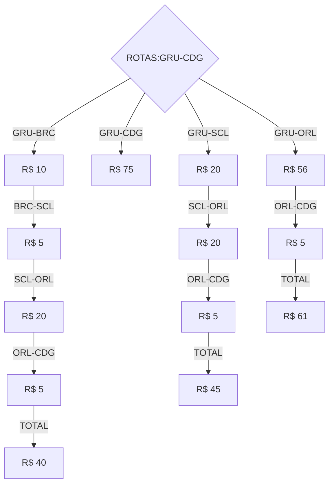

# Sobre
> [!NOTE]
> Estou sem meu computador no momento e estou utilizando o recurso do CodeSpace do github para desenvolver a partir de meu tablet.

> [!WARNING]
> Não consegui executar o projeto API pois esta dando erro no CodeSpace.

### Diagrama das possiveis rotas entre GRU e CDG


Projeto de testes executado com sucesso.
```C#
    [Theory]
    [InlineData("GRU","CDG", 40)]
    [InlineData("BRC","SCL", 5)]
    public async Task QuandoFornecerRotasValidas_RetornarSucesso(string origem, string destino, decimal valor)
    {

        var calculoRotas = new CalculoRotasService(rotas);
        var rotaMaisEconomica = await calculoRotas.GetRouteWithLowerPrice(locais[origem], locais[destino]);
        Assert.Equal(valor, rotaMaisEconomica.Sum(r => r.Valor));       

    }
```

## Instruções para execução

### Executar o projeto de teste
```
dotnet test
```

### Executar o projeto API
```
dotnet run
```

